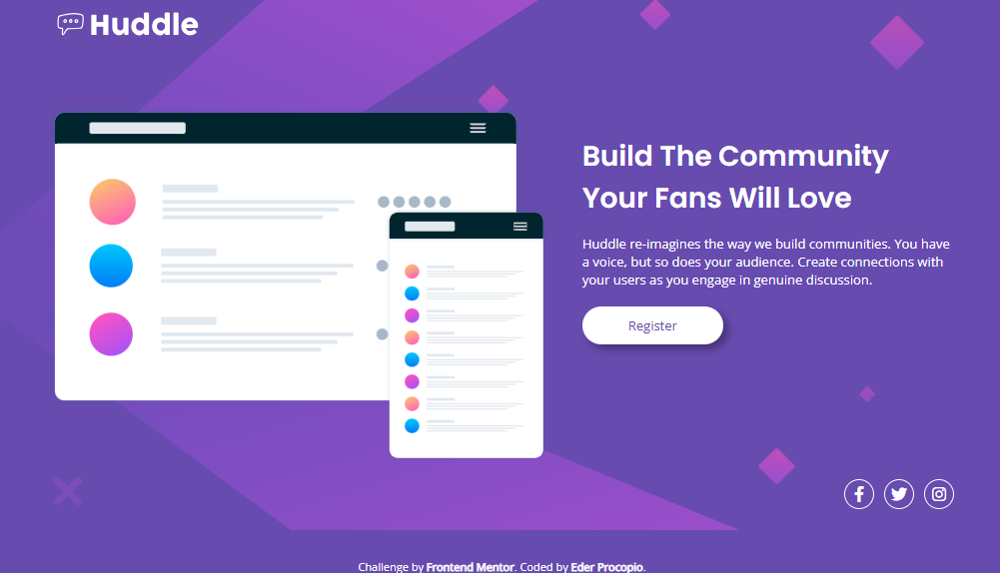

# Frontend Mentor - Huddle landing page with single introductory section

## Olá! 👋

Essa é a resolução de um desafio proposto pelo site <a href="https://www.frontendmentor.io/home" target="_blank">Frontend Mentor</a>, com o objetivo de testar minhas habilidades em desenvolvimento front-end. Pretendo compartilhar uma série de desafios à medida que avanço. Esse é o meu terceiro projeto.

## Sobre o Frontend Mentor:

O Frontend Mentor é uma plataforma que oferece desafios de desenvolvimento front-end para ajudar programadores a aprimorar suas habilidades. A plataforma é voltada tanto para iniciantes quanto para desenvolvedores experientes. O site disponibiliza projetos práticos de diversos níveis de dificuldade, permitindo que os usuários pratiquem a construção de layouts responsivos, implementem funcionalidades interativas e aperfeiçoem suas habilidades em HTML, CSS e JavaScript. 
Os desafios geralmente incluem um design de interface pré-definido (em formatos como Figma ou imagens), e cabe ao desenvolvedor escrever o código para trazer esse design à vida. Além disso, os participantes podem compartilhar suas soluções e receber feedback da comunidade, tornando o processo de aprendizado mais colaborativo. 
É uma excelente forma de desenvolver habilidades práticas e construir um portfólio, especialmente para aqueles que buscam experiência real em desenvolvimento front-end.

## Sobre o desafio

Este desafio consiste em recriar uma <i>landing page</i> introdutória simulando um <i>blog</i>. A página conta com um botão principal que muda de cor ao passar o cursor e três ícones com links para as principais redes sociais, que também mudam de cor ao serem interagidos. 
A proposta inclui um design responsivo, adaptável a  dispositivos móveis.

### Design para desktop

  

### Design mobile

  

### Estado ativo

  

## Solução

Para a solução, utilizei HTML e CSS. Decidi testar minhas habilidades aplicando tanto <i>flexbox</i> quanto <i>grid</i>. 
Resolvi também, pela primeira vez, utilizar a abordagem Mobile First e tentei deixar o layout mais adaptável usando medidas em porcentagem. Os ícones das redes sociais são links reais que levam às respectivas plataformas, enquanto o botão principal é decorativo, por motivos óbvios, mas cumpre sua função de design ao mudar de cor ao ser interagido. 
Neste terceiro desafio, experimentei uma abordagem diferente: por se tratar de um design responsivo, priorizei a responsividade, deixando a semelhança com o design original em segundo plano.

### Link da solução

  
